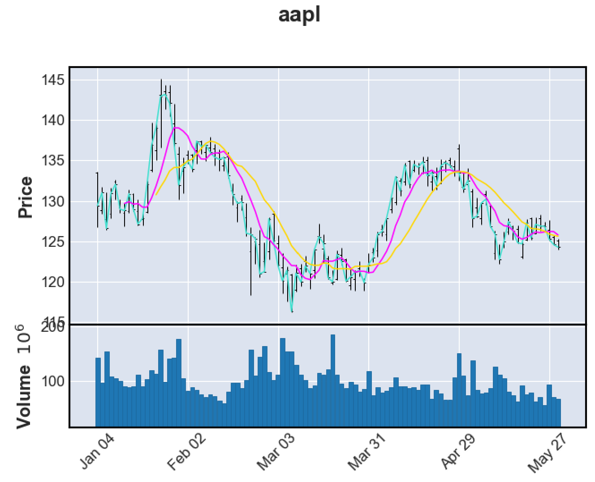

# tiingo-candlestick

Generate candlestick plots using [Tiingo](https://www.tiingo.com/) API and [mplfinance](https://github.com/matplotlib/mplfinance).

## Usage

Create a `.env` file in the folder with the line: `TOKEN={your Tiingo API token}`.

```
cli.py [-h] [--from YYYY-MM-DD] [--to YYYY-MM-DD] [--mav MAV [MAV ...]] [--volume] symbol

positional arguments:
  symbol               Tiingo symbol

optional arguments:
  -h, --help           show this help message and exit
  --from YYYY-MM-DD    from date in ISO format
  --to YYYY-MM-DD      to date in ISO format
  --mav MAV [MAV ...]  moving average windows
  --volume             add a volume plot
  ```

## Example

```
python cli.py aapl --from 2021-01-01 --to 2021-06-01 --mav 1 7 14 --volume
```

